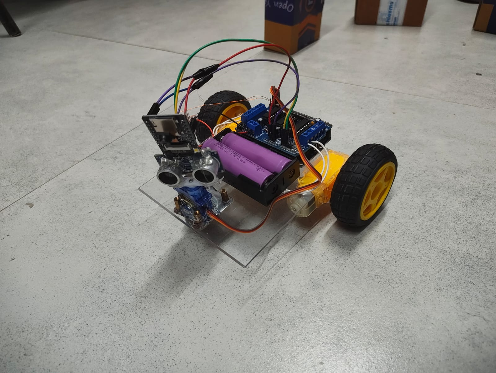

# MxAiCombat
#### An AI powered pilot assistance module for Un-manned combat ground vehicle, that can detect obstacles and threats on the terrain, irrespective of visibility and weather conditions.
---


## REPOSITORY TREE
```text
    | REPOSITORY
    |    |ENV_SETUP
    |    |scripts
    |        |training
    |        |testing
    |    |predictions
    |    |training stats
    |
    | Self-driving vehicle based on our model.
    |      | ESP32
    |      | OpenCV
    |      | Ardunio UNO
    |      | Main Board
    
```

## Harware Conifguration - Autonomous Car
#### 1. Install Ardunio IDE.
#### 2. Upload firmware in Ardunio UNO and ESP32.
### How to get on-screen output?
```bash
cd OpenCV
```
#### Run the file for the video live output on screen.


## INSTALLATION
#### 1. Clone the github repository using:
```bash
git clone https://github.com/pizzaparth/MxAiCombat.git
```

#### 2. Install Anaconda
#### 3. Setup the ENV using
#### Open the anaconda prompter and then: 

```bash
cd ENV_SETUP
setup_env.bat
```
This will install all the dependencies required.

### How to train the model? Using Anaconda.
```bash
conda setup EDU
cd scripts
cd training
python train-21.py
```
### How to test the model? Using Anaconda.
```bash
conda setup EDU
cd scripts
cd testing
python test-21.py
```
